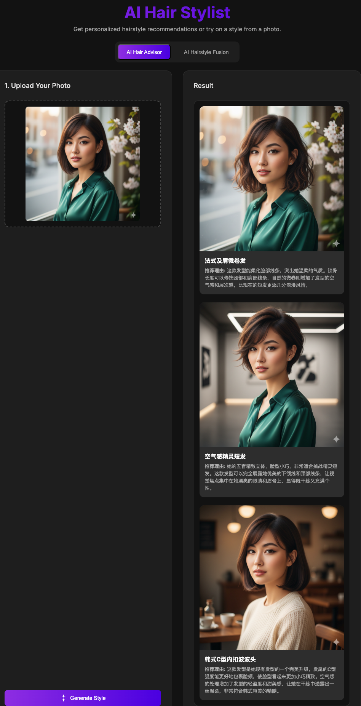
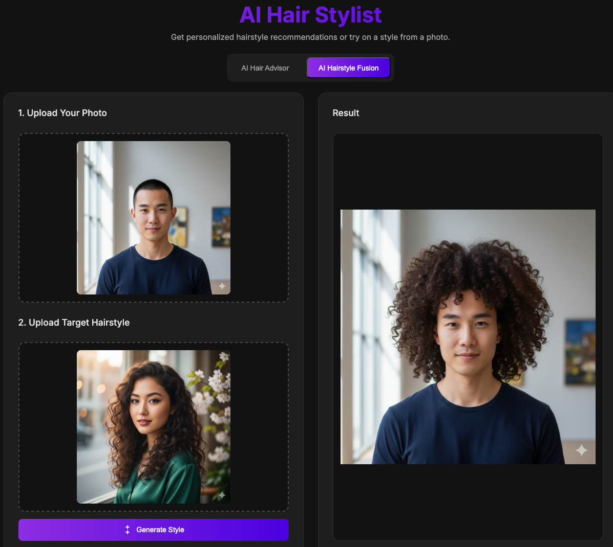

# AI Hair Stylist | AI 发型顾问

<div align="center">

**An intelligent AI-powered application that provides personalized hairstyle recommendations and image fusion based on your photos.**

**一款智能AI发型顾问应用，根据你的照片提供个性化发型推荐和图像融合功能。**

---

⭐ **If you find this project helpful, consider giving it a star or treating me to a coffee!** ⭐

⭐ **如果觉得这个项目有帮助，不妨给个星标或请我喝杯咖啡！** ⭐

</div>

## 📖 Overview | 项目简介

AI Hair Stylist is a cutting-edge web application powered by Google's Gemini AI models that revolutionizes hair styling consultations. Using advanced image generation and analysis capabilities, it offers two powerful modes to help you explore new hairstyles:

1. **AI Hair Advisor** - Analyzes your facial features and recommends 3 personalized hairstyles with AI-generated visualizations
2. **AI Hairstyle Fusion** - Applies any hairstyle from a reference image onto your photo seamlessly

---

AI发型顾问是一款基于Google Gemini AI模型的创新发型咨询应用。它利用先进的图像生成和分析功能，提供两种强大模式帮助您探索新发型：

1. **AI发型顾问** - 分析您的面部特征并推荐3款个性化发型，附带AI生成的视觉效果图
2. **AI发型融合** - 将参考图片中的任意发型无缝应用到您的照片上

## ✨ Features | 核心功能

### 🎯 AI Hair Advisor | AI发型顾问
- **Facial Feature Analysis** - AI analyzes your face shape, features, and overall appearance
- **Personalized Recommendations** - Receives 3 tailored hairstyle suggestions
- **Detailed Descriptions** - Each recommendation includes style name, description, and detailed reasoning in Chinese
- **Visual Previews** - AI generates realistic preview images for each recommended style
- **面部特征分析** - AI分析您的脸型、五官和整体外观
- **个性化推荐** - 获得3款量身定制的发型建议
- **详细说明** - 每个推荐包含中文发型名称、描述和详细理由
- **可视化预览** - AI为每个推荐发型生成逼真的预览图

### 🔀 AI Hairstyle Fusion | AI发型融合
- **Seamless Image Fusion** - Applies any hairstyle from a reference photo to your picture
- **Realistic Blending** - AI naturally matches hair to your head shape, face, and skin tone
- **High-Quality Results** - Photorealistic outputs that maintain natural lighting and perspective
- **无缝图像融合** - 将参考照片中的任意发型应用到您的图片上
- **真实融合** - AI自然地匹配您的头型、脸部和肤色
- **高质量效果** - 逼真的输出效果，保持自然光线和透视

## 🖼️ Screenshots | 效果展示

### AI Hair Advisor Mode | AI发型顾问模式



*AI为您分析面部特征并推荐3款个性化发型，每个推荐都附带详细的理由说明*

*AI analyzes your facial features and recommends 3 personalized hairstyles with detailed reasoning*

### AI Hairstyle Fusion Mode | AI发型融合模式  



*将参考发型无缝融合到您的照片，AI智能匹配头型、脸部轮廓和肤色*

*Seamlessly fuse reference hairstyle onto your photo with AI-powered matching*

## 🛠️ Tech Stack | 技术栈

- **Frontend**: React 19.2.0 + TypeScript
- **Build Tool**: Vite 6.2.0
- **AI SDK**: @google/genai 1.28.0
- **AI Models**:
  - `gemini-2.5-pro` - Text generation and analysis
  - `gemini-2.5-flash-image` - Image generation

## 🚀 Quick Start | 快速开始

### Prerequisites | 环境要求

- **Node.js** >= 18.0.0
- **Google Gemini API Key** - Get one at [Google AI Studio](https://makersuite.google.com/app/apikey)

### Installation | 安装步骤

1. **Clone the repository**
```bash
git clone https://github.com/XZL-CODE/AI-Hair-Stylist-and-Advisor.git
cd AI-Hair-Stylist-and-Advisor
```

2. **Install dependencies | 安装依赖**
```bash
npm install
```

3. **Configure API Key | 配置API密钥**

Create a `.env.local` file in the project root:
在项目根目录创建 `.env.local` 文件：

```bash
GEMINI_API_KEY=your_api_key_here
```

> ⚠️ **Important**: Never commit your `.env.local` file to version control!
> 
> ⚠️ **重要**: 永远不要将 `.env.local` 文件提交到版本控制系统！

4. **Run the development server | 启动开发服务器**
```bash
npm run dev
```

The application will open at `http://localhost:3000`

### Build for Production | 生产环境构建

```bash
npm run build
npm run preview
```

## 📖 Usage Guide | 使用指南

### Using AI Hair Advisor | 使用AI发型顾问

1. Select **"AI Hair Advisor"** mode
2. Upload a clear front-facing photo of yourself
3. Click **"Generate Style"**
4. Wait for AI analysis (typically 30-60 seconds)
5. Review 3 personalized recommendations with visual previews

**最佳实践**:
- Use a clear, front-facing photo with good lighting
- Ensure your face is fully visible
- Remove sunglasses or hats for better analysis

### Using AI Hairstyle Fusion | 使用AI发型融合

1. Select **"AI Hairstyle Fusion"** mode
2. Upload your photo
3. Upload a reference image with the target hairstyle
4. Click **"Generate Style"**
5. Wait for the fusion process (typically 20-40 seconds)

**最佳实践**:
- Both images should have good lighting and clarity
- The reference hairstyle should be clearly visible
- Similar angles and lighting will produce better results

## 💰 API Costs | API费用

This application uses Google Gemini API, which has a **pay-as-you-go** pricing model. Typical usage:

- **AI Hair Advisor**: ~500-1000 tokens per request + 3 image generations
- **AI Hairstyle Fusion**: ~200 tokens + 1 image generation

Please refer to [Google's pricing page](https://ai.google.dev/pricing) for current rates.

> 💡 **Tip**: Google often provides free tier credits for new users

本应用使用Google Gemini API，采用**按量付费**模式。典型使用情况：

- **AI发型顾问**: 每次请求约500-1000 tokens + 3次图像生成
- **AI发型融合**: 约200 tokens + 1次图像生成

请参考 [Google定价页面](https://ai.google.dev/pricing) 查看当前费率。

> 💡 **提示**: Google经常为新用户提供免费额度

## ⚙️ Configuration | 配置说明

### Environment Variables | 环境变量

| Variable | Description |
|----------|-------------|
| `GEMINI_API_KEY` | Your Google Gemini API key (required) |

### Customization | 自定义

You can modify the AI prompts in `index.tsx` to adjust the recommendation style:

- **Line 94-101**: Text analysis prompt for AI Hair Advisor
- **Line 200**: Fusion instruction prompt

## 🔒 Security | 安全性

- ✅ API key is stored in `.env.local` (not committed to git)
- ✅ All API calls are made from the client-side
- ✅ No sensitive data is stored or logged
- ✅ `.env.local` is already in `.gitignore`

## 📝 License | 许可证

This project is open source and available under the MIT License.

本项目采用 MIT 许可证开源。

## 🤝 Contributing | 贡献指南

Contributions are welcome! Please feel free to submit a Pull Request.

欢迎贡献！请随时提交 Pull Request。

## 📧 Contact | 联系方式

For questions or suggestions, please open an issue on GitHub.

如有问题或建议，请在GitHub上提交issue。

## 💝 Support | 支持项目

**Enjoying this project? Why not buy me a coffee? ☕️**

**这个项目对你有帮助吗？不如请我喝杯咖啡吧！☕️**

Your support helps me continue developing useful open-source tools!

您的支持将帮助我继续开发有用的开源工具！

<div align="center">

### 支持方式 / Ways to Support

<table>
  <tr>
    <td align="center">
      
      <br/>
      <b>微信支付</b>
      <br/>
      <b>WeChat Pay</b>
    </td>
    <td align="center">
      
      <br/>
      <b>支付宝</b>
      <br/>
      <b>Alipay</b>
    </td>
    <td align="center">
      
      <br/>
      <b>USDT</b>
      <br/>
      <b>(TRC20)</b>
    </td>
  </tr>
</table>

</div>

> 💡 **Important Notes | 重要说明**
> 
> - ✨ **This is a voluntary donation, not a purchase of goods or services** | **这是自愿捐赠，并非购买商品或服务**
> - 📝 **Donations help cover API costs and server expenses for development** | **捐赠用于支付 API 成本和服务器费用**
> - 🆓 **This project remains free and open source** | **本项目保持免费和开源**
> - 🙏 **All donations are appreciated but not required** | **感谢所有支持，但不强求**
> 
> 🙏 **Thank you for your support! Every coffee keeps the code brewing!**
> 
> 🙏 **感谢您的支持！每一杯咖啡都是我继续写代码的动力！**

---

<div align="center">

**Built with ❤️ using Google Gemini AI**

**使用 Google Gemini AI 构建**

</div>
